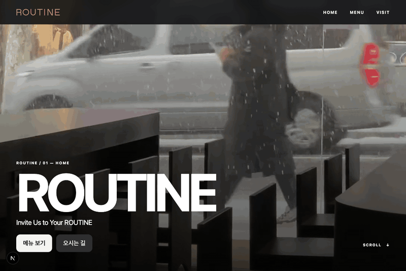
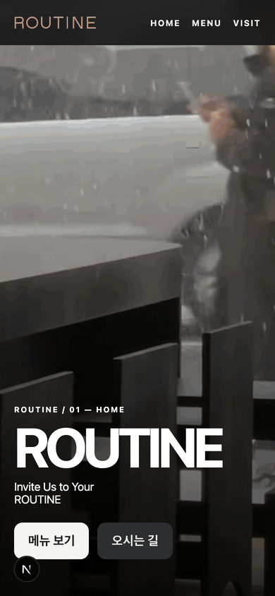
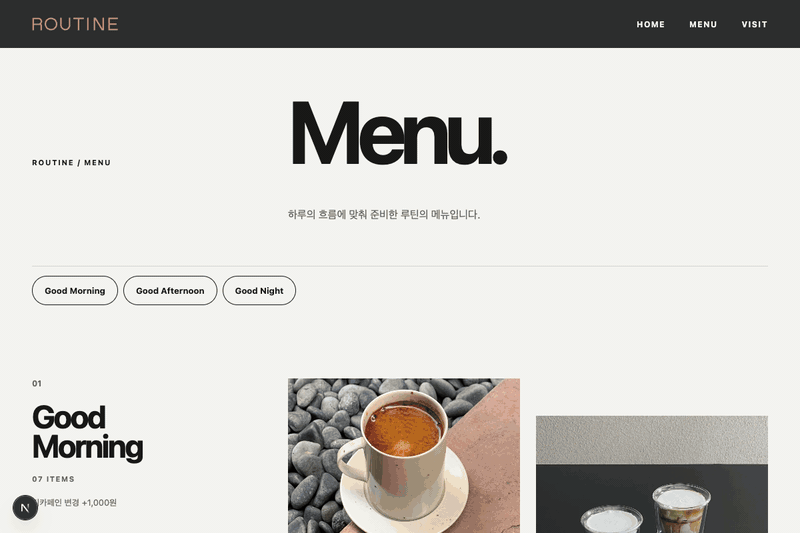
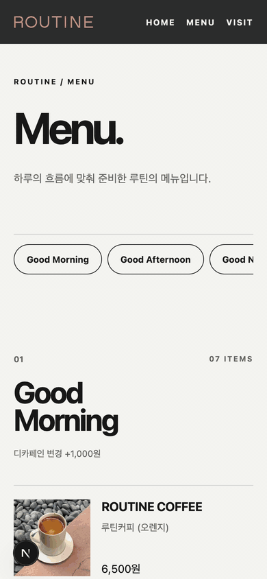
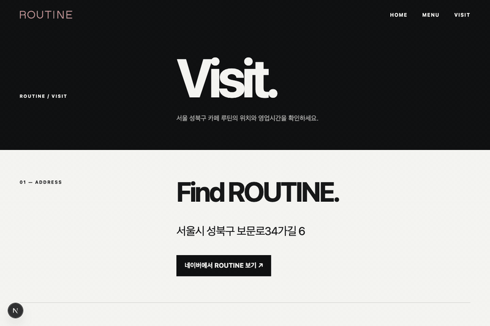
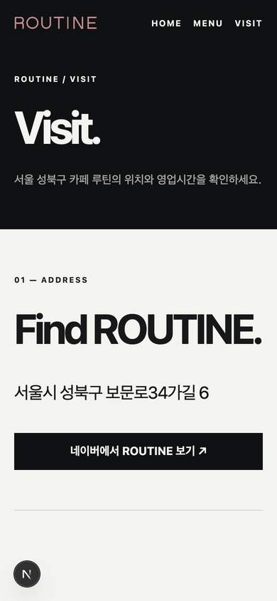

# ROUTINE (카페 루틴)

> **Invite Us to Your ROUTINE**  
> 서울 성북구 보문로의 카페 루틴(ROUTINE) 공식 웹사이트입니다.  
> Black & White 모노크롬 톤앤매너와 차분하고 정돈된 일상의 휴식을 전달합니다.

---

## 🎬 주요 화면 (Previews)

### 1. Home (`/`)
매장의 정체성과 감각적인 무드를 전달하는 메인 뷰입니다.
- **Hero Video**: 배경 영상과 함께 브랜드 문구(`Invite Us to Your ROUTINE`) 제공
- **Space Gallery**: 안뜰(Courtyard), 긴 테이블(Long Table), 밤의 정원(Night Garden) 등 루틴의 공간을 담은 8장의 갤러리
- **Interactive UI**: 뷰포트 진입 시 부드러운 Reveal 모션과 우측 하단 상단 이동(Scroll to Top) 버튼 제공

<table>
  <thead>
    <tr>
      <th width="65%" align="center">Desktop</th>
      <th width="35%" align="center">Mobile</th>
    </tr>
  </thead>
  <tbody>
    <tr>
      <td valign="top"></td>
      <td valign="top"></td>
    </tr>
  </tbody>
</table>

---

### 2. Menu (`/menu`)
하루의 흐름에 맞춰 준비된 루틴의 음료 및 디저트 메뉴를 탐색하는 뷰입니다.
- **Category Navigation**: 카테고리(Good Morning 등) 앵커 탭을 통한 빠른 섹션 이동
- **Item Details**: 메뉴 사진, 상세 설명, 가격, 디카페인 옵션 안내 및 품절 상태 실시간 반영

<table>
  <thead>
    <tr>
      <th width="65%" align="center">Desktop</th>
      <th width="35%" align="center">Mobile</th>
    </tr>
  </thead>
  <tbody>
    <tr>
      <td valign="top"></td>
      <td valign="top"></td>
    </tr>
  </tbody>
</table>

---

### 3. Visit (`/visit`)
루틴을 찾아오시는 분들을 위한 매장 위치, 영업시간, 연락처 안내 뷰입니다.
- **Address**: 매장 주소 안내 및 네이버 지도(플레이스) 연동 링크
- **Hours**: 매일(11:00–22:00) 정기 영업시간 테이블
- **Contact**: 원터치 매장 전화 걸기 및 공식 Instagram 바로가기

<table>
  <thead>
    <tr>
      <th width="65%" align="center">Desktop</th>
      <th width="35%" align="center">Mobile</th>
    </tr>
  </thead>
  <tbody>
    <tr>
      <td valign="top"></td>
      <td valign="top"></td>
    </tr>
  </tbody>
</table>

---

## 🛠 Tech Stack

- **Framework**: [Next.js 16](https://nextjs.org/) (App Router, Turbopack)
- **Language**: [TypeScript](https://www.typescriptlang.org/)
- **UI & Styling**:
  - [SEED Design](https://seed-design.io/) (`@seed-design/react`, `@seed-design/css`)
  - [Vanilla Extract](https://vanilla-extract.style/) (`@vanilla-extract/css`)
- **Backend & Data**: [Supabase](https://supabase.com/) (`@supabase/ssr`, `@supabase/supabase-js`)
- **Web Capabilities**:
  - **PWA**: 오프라인 캐싱 및 홈 화면 추가 지원 (Service Worker, Web App Manifest)
  - **SEO**: JSON-LD 구조화 데이터(`CafeOrCoffeeShop`), Open Graph 메타데이터 최적화

---

## 🚀 Getting Started

### 1. 의존성 설치
```bash
pnpm install
```

### 2. 환경 변수 설정
`.env.example`을 복사하여 `.env.local`을 생성하고 필요한 Supabase 키를 입력합니다.
```bash
cp .env.example .env.local
```

### 3. 개발 서버 실행
```bash
pnpm dev
```
브라우저에서 `http://localhost:3000`으로 접속합니다.

### 4. 검증 및 빌드
```bash
pnpm typecheck   # TypeScript 타입 검사
pnpm lint        # ESLint 정적 분석
pnpm build       # 프로덕션 빌드
```

---

## 📍 Store Information

- **위치**: 서울시 성북구 보문로34가길 6
- **영업시간**: 매일 11:00 – 22:00
- **전화번호**: 02-6489-4589
- **Instagram**: [@cafe.routine](https://www.instagram.com/cafe.routine/)
- **네이버 플레이스**: [ROUTINE 네이버 플레이스](https://m.place.naver.com/restaurant/1023734971/home?entry=pll)
